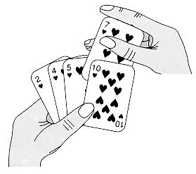

#### 插入排序

> 参考文章： http://gaunthan.leanote.com/post/%E7%9B%B4%E6%8E%A5%E6%8F%92%E5%85%A5%E6%8E%92%E5%BA%8F
> 插入排序Insertion Sort 是初等排序的一种，也成为直接插入排序。

##### 思想

对于少量元素的排序，插入排序是一个有效的算法。它的工作方式像排序一手扑克牌。开始时，我们左手为空并且桌子上的牌面向下。然后我们每次从桌子上拿走一张牌并将它插入左手中正确的位置上。拿在左手上的牌总是排好序的，右手从桌子上再起一张牌，插入到左手中。

动态图：

##### 运行效率分析

* 当输入已有序，每一个元素只需跟其前面的那个元素进行比较，比较次数为n-1, 因此插入排序的最好时间复杂度为O(n).
* 当输入是逆序的，插入第i个元素需要移动i-1个元素，显然最坏情况下时间复杂度会渐进为O(n2).
* 由于输入平均是乱序的，因此插入排序的平均时间复杂度也是平方级的。

结论：
* 当文件初态基本有序时，直接插入排序所需的比较和移动次数均比较少。当n值较小时，n和n2的差别也比较小。因此若输入基本是有序的，使用插入排序可以得到非常高的效率.
